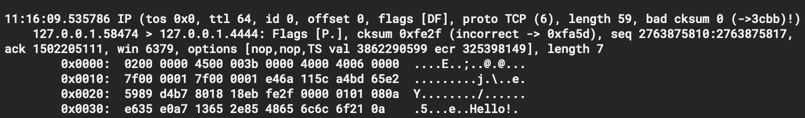
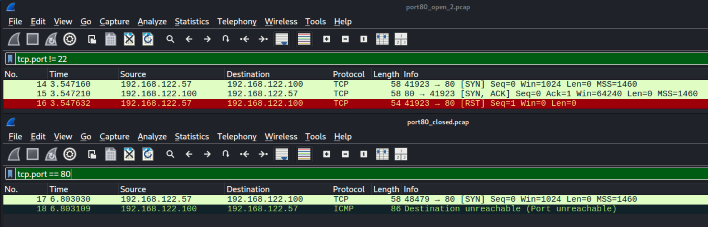

# `tcpdump`: utility that captures and displays the raw contents of network traffic packets 
`tcpdump` prints out a description of the contents of packets on a network interface matching a boolean expression.

----

The command has many options that can be explored. The links below can be helpful in breaking the ice. Additionally, the packt capture can be saved in a file and analyzed with [Wireshark](https://www.wireshark.org/).

In the picture above, two separate captures can be seen side-by-side: `port80_open_2.pcap` and `port80_closed.pcap`. They show a partial three-way handshake between a *host* (`192.168.122.57`), running Kali + `nmap`, and a *target* (`192.168.122.100`) with its port 80 either open or closed.

----

### Useful links
- [A tcpdump Tutorial with Examples — 50 Ways to Isolate Traffic](https://danielmiessler.com/study/tcpdump/)
- [TCPDump Examples – 30 Best Commands Ever!](https://www.shellhacks.com/tcpdump-examples-30-best-commands-ever/)
- [Masterclass – Tcpdump – Expressions](https://packetpushers.net/blog/masterclass-tcpdump-expressions/)
